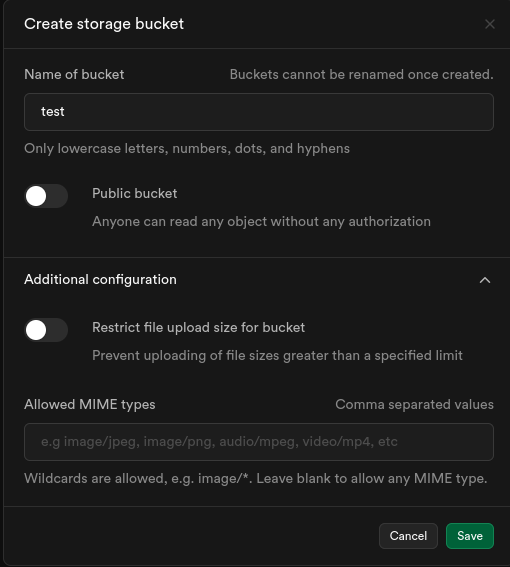
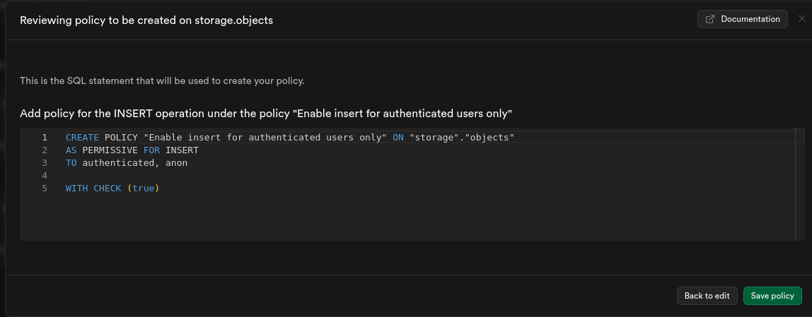
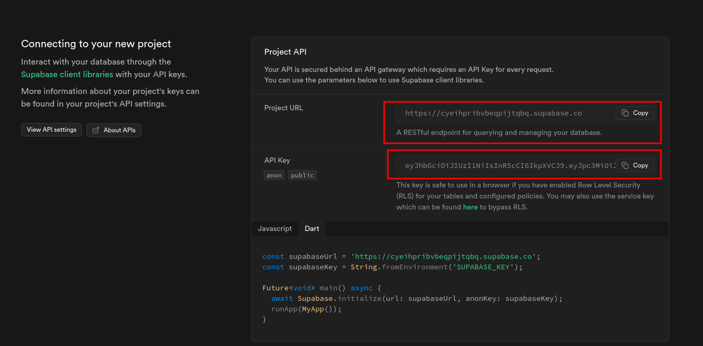

# Tests for Resumable

- How to run tests?


### Create a new project

- Create 1 new empty project from the [Dashboard](https://supabase.com/dashboard/projects).


### Create a new bucket

- Create 1 new empty bucket named "test".




### Create policies

- Create policies to allow read/write operations into the bucket.
- Policies should grant read access into `storage.objects` and `storage.buckets`.
- Policies should grant insert (upload) and delete access of resources.
- Set temporary promiscuous permissions for testing purposes only (delete it after tests).




#### Policies templates

- Example templates for policies, **must be edited before use** to fit your use case.

At `storage.objects`:

```sql
CREATE POLICY "Enable all access for all users" ON "storage"."objects"
AS PERMISSIVE FOR ALL
TO public
USING (true)
WITH CHECK (true);
```

At `storage.buckets`:

```sql
CREATE POLICY "Enable all access for all users" ON "storage"."buckets"
AS PERMISSIVE FOR ALL
TO public
USING (true)
WITH CHECK (true);
```


### Set environment variables



```bash
export SUPABASE_URL = 'Supabase_HTTPS_URL_here'
export SUPABASE_KEY = 'Supabase_API_Key_here'
export TEST_BUCKET  = 'test'  # BucketName
```


### Run tests

```bash
poetry run pytest tests/resumable -v -s
```

- You can delete the bucket and policies after running the tests.
